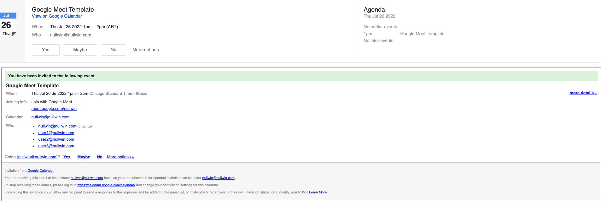

# GoMeetPhish
Google Meet Phishing Template For Gophish

# Why a google meet invite phish template?

When was the last time youve checked for a phishing on a google meet invite? Right...

Disclaimer: All information to use for “Ethical Hacking” purpose respectively,  All the information provided here is for educational purposes only.

This template was developed for its use in gophish (https://github.com/gophish/gophish - Gophish: Open-Source Phishing Toolkit), however can be used in any environment needed or desired)

The reason for its creation started because of limitations when gophish tries to import the website to create the email landing.

As gophish Documentation reads,

https://docs.getgophish.com/user-guide/documentation/templates

"A "Template" is the content of the emails that are sent to targets. They can be imported from an existing email, or created from scratch. They also support sending attachments.
Additionally, templates can contain tracking images so that gophish knows when the user opens the email."

Importing an Email
Gophish supports the ability to import an email from the raw content. To do this, click the "Import Email" button and paste in the original email content. This content is usually found through the "View Original" feature of many mail clients:

# Google Meet Import email issue on gophish:

When the original is copied and pasted inside the email exporter on gophish, the exported email looks like this,

 We can see the exported email lacks pretty much all the google meet invitation design, for this reason ive created an html template to use on gophish using its own html editor.

 As you can see now the current html code includes every aspect of the email invitation sent on google invites.

 A few considerations, always take into account youll need to edit a few aspects of the template to look as real as possible,

* Language
* Sender
* Time and Dates
* Timezones

Check Gophish Documentation on how to set:

* href="{{.URL}}"
* {{.Tracker}}

 
 
# How to avoid being phished by a google meet template?

Besides the normal phishing detection techniques as checking email domain address, links domains, attachments, theres a Silver Bullet.

# The Silver Bullet:

Google meet template invitation has a simple solution which allows to spot a fake email, when someone sends a google meet invitation by calendar, the recipient will receive an email and a google calendar notice, since the email is being sent externally, the google meet notice will not appear con the calendar, showing the received invite is false.

You can find the HTML Code Here,

[Link](/Code/Gomeetphishing.html)

Let me know if anything.

# Polem4rch

